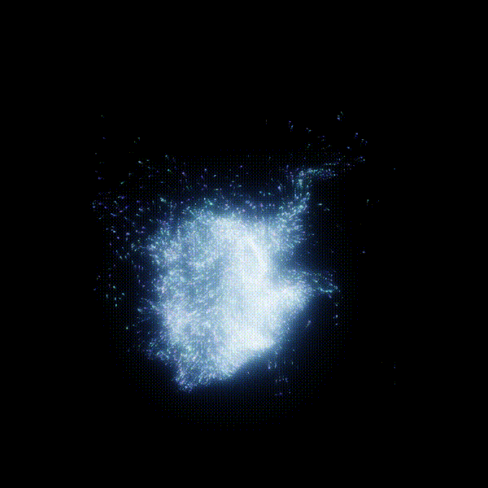

# Real-time Particle System in TouchDesigner

A particle system is a collection of independent objects, often represented by dots or other simple shapes (see [*The Nature of Code*](https://natureofcode.com/particles/)). Particles move and change over time according to a set of rules (in this case Newtonian mechanics). The patterns that emerge from these simple rules give rise to complex systems.

<p align="center">
        
</p>

## How It Works

### Particle Struct
In this project, each particle is represented as a discrete unit of data. This means every particle calculates its own acceleration, velocity, and position based on the forces acting upon it. Here is what a single particle looks like in our GLSL code:

```glsl
// Particle data structure
struct Particle {	
    uint id;        // Unique identifier
    vec3 pos, vel;  // Position and Velocity (Physics)
    float age, life;// Current age and maximum lifespan
    float seed;     // Random seed for visual variation

    // Derived properties for rendering
    vec3 size;
    vec4 color;
};
```

### The GPU
Particles are completely independent of one another, making them perfect candidates for the GPU. We can map each GPU thread to a single unique particle. The main challenge then becomes how we access and update the attributes of these particles, as memory management is crucial for performance.

### State and Data Management
To keep the simulation efficient, a particle's properties are split into two categories based on how they utilise GPU memory.

- **Stateful Properties** depend on history. Because their current value is the result of accumulated changes over time, they **must** be stored in GPU memory between frames. Each has a reset rule (at birth) and an update rule (per frame):

- **Derived Properties** are pure functions of the current state and parameters. They are computed fresh every single frame and are **never** stored in memory between frames.

Because we are managing memory on the GPU, we don't actually "create" or "destroy" particles, as that would be too slow. Instead, we maintain a fixed pool of particles where each individual particle is treated as a state machine. The state machine logic can be seen in our `main.glsl` compute shader.

```mermaid
flowchart LR
    %% Define colors (Light blue fill, dark blue border, black text)
    classDef stateNode fill:#e1f5fe,stroke:#0288d1,stroke-width:2px,color:#000;

    %% Nodes
    Start(( ))
    style Start fill:#333,stroke:#333,stroke-width:2px;
    
    BIRTH["<b>BIRTH</b><br>Reset Attributes<br>New Seed"]:::stateNode
    LIFE["<b>LIFE</b><br>Update Physics<br>Render"]:::stateNode
    DEATH["<b>DEATH</b>"]:::stateNode

    %% Edges
    Start --> BIRTH
    BIRTH --> LIFE
    LIFE -->|"age > 0"| LIFE
    LIFE -->|"age <= 0"| DEATH
    DEATH -->|"ε"| BIRTH
```



The cycle is driven by the particle's `age`. Each frame, every particle's `age` is decremented by the frame time (`uDelta`). Depending on this value, the particle is processed through one of three states **Birth**, **Life**, and **Death**.

#### Birth (`Reset`)
When a particle's age reaches zero, it immediately transitions back to Birth to reuse the memory allocation. All stateful properties are reinitialised: age is set to a new random lifespan, pos and vel receive new starting values, and a fresh seed is generated. The seed remains constant throughout the particle's life and is used to derive visual properties.

#### Life (`Update`)
While alive (age > 0), the particle simulates physics and renders visuals. Forces are applied to calculate a new velocity, which updates the position. These accumulated changes are written back to GPU memory for the next frame.

Derived properties like size and color are not saved in memory, yet they stay consistent because the random functions are deterministic -- passing the same seed always produces the same result. This also means that changing a parameter in TouchDesigner causes all living particles to instantly recompute their visuals, making the system responsive for live performance.

#### Death
Death is instantaneous. When age reaches zero, the particle immediately transitions back to Birth (the ε transition in the diagram). The particle count never changes; the pool is always full.

<!-- ### Summary of Property Updates

| Property | Category | Birth State (`Reset`) | Life State (`Update`) |
|----------|----------|-----------------------|-----------------------|
| `age` | Stateful | Random from `uLife` distribution | Decremented by `uDelta` |
| `pos` | Stateful | Random around emission point | `pos += vel * dt` |
| `vel` | Stateful | Random direction × speed | Forces, damping, boundary collision |
| `seed`| Stateful | Newly generated random float | Remains constant |
| `mass` | Derived | -- | `volume(size) * uDensity` |
| `size` | Derived | -- | Base size × envelope(progress) |
| `color` | Derived | -- | HSV from `seed`, interpolated, with flash |
-->


## Parameters

The system is controlled via Custom Parameters on the TouchDesigner component. These parameters define the distributions (what values are possible) and behaviors (how values evolve). They define the space from which values are drawn using the particle's random seed.

| Group | Parameter | Description |
|-------|-----------|-------------|
| **System** | `Time` | Simulation clock, usually driven by `absTime.seconds`. |
| | `Number of Points` | Total number of particles in the GPU buffer. |
| | `Reset` | Pulse to clear all buffers and restart. |
| **Emission** | `Life Mean` / `Spread` | Lifespan in seconds. `Mean` is the average, `Spread` is the random variation. |
| | `Pos Spread` (XYZ) | Spawn spread from center. Higher = wider cloud. |
| | `Direction` (XYZ) | Average direction particles travel when born. |
| | `Dir Spread` (XYZ) | Variation in birth direction. Higher = more scatter.
| | `Speed Mean` / `Std` | Initial speed magnitude in the birth direction. |
| **Physics** | `Mass Influence` | How much mass resists forces. `0` = ignored, `1` = full effect. |
| | `Damping` | Velocity decay. Higher = more air resistance. | 
| | `Bounds Size` | Size of invisible bounding cube. Particles bounce off walls. |
| | `Restitution` | Bounce energy. `0` = stick, `1` = perfect bounce. |
| | `Density` | Computes mass from particle volume. |
| **Forces** | `Amplitude` / `Period` | Strength and scale of the Curl Noise force field. |
| *(Noise TOP)* | `Speed` / `Exponent` | Animation speed and turbulence of the noise field. |
| **Size** | `Size Min` (XYZ) | Smallest possible particle scale. |
| | `Size Max` (XYZ) | Largest possible particle scale. |
| | `Bias` | Distribution bias. `> 1` = mostly small, `< 1` = mostly large. |
| | `Size Attack/Decay` | Fade-in duration at birth / shrink duration at death. |
| **Color** | `Hue Mean` / `Std` | Base hue (0-1 color wheel) and random variation. |
| | `Saturation Mean` / `Std` | Color intensity and random variation. |
| | `Brightness Mean` / `Std` | Brightness and random variation. |
| | `Color Shift` | Hue shift over lifetime. `1.0` = full color wheel. |
| | `Color Attack/Decay` | Alpha fade-in / fade-out duration. |
| | `Flash Color` (RGBA) | Color particles flash just before dying. |

## Project Structure

The GLSL shaders are externalized in `src/glsl/` and referenced by the `.toe` via relative paths. The main compute shader includes the others in order: `particle` → `utils` → `behaviour`.

```
├── ParticleSystem.toe             # Full runnable project
├── src/
│   └── glsl/
│       ├── particle.glsl          # Particle struct + GPU buffer I/O
│       ├── utils.glsl             # Math, RNG, envelopes, color conversion
│       ├── behaviour.glsl         # Physics, lifecycle (Reset/Update), rendering
│       ├── main.glsl              # Entry point: the state machine loop
│       └── init.glsl              # One-time bootstrap (assign IDs, trigger first birth)
└── tox/
    └── ParticleSystem.tox         # Importable component
```

## Requirements

- TouchDesigner 2023.11760 (or later)
- GPU with OpenGL 4.3+ support

## Usage

### Open full project

Open `ParticleSystem.toe` in TouchDesigner.

### Import as component

Drag `tox/ParticleSystem.tox` into any TouchDesigner project to use the particle system as a standalone module. Need to move the `*.glsl` files accordingly. 

## License

MIT
